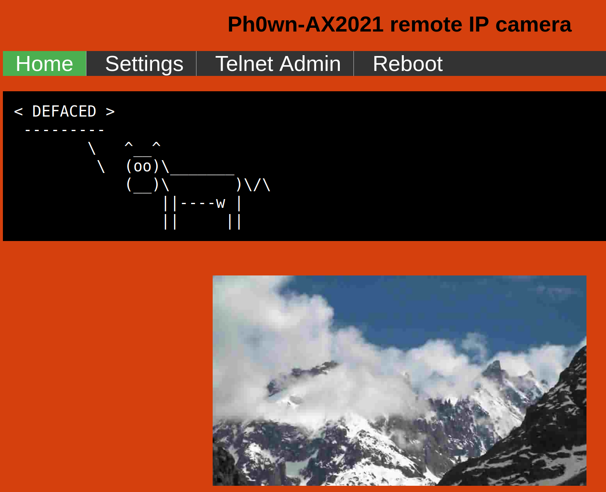
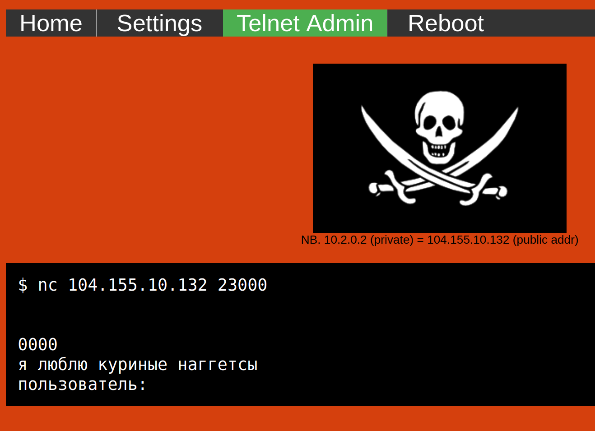
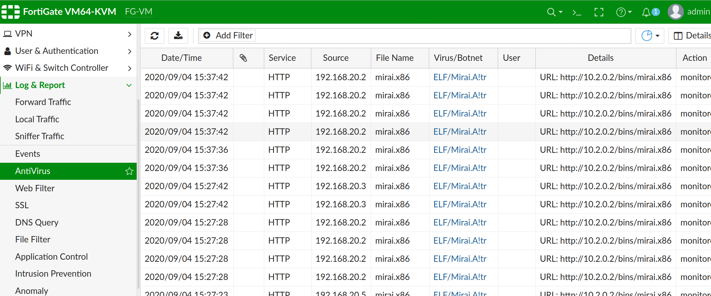
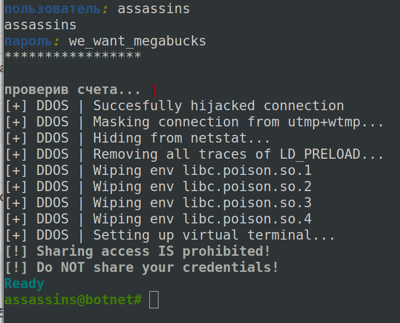
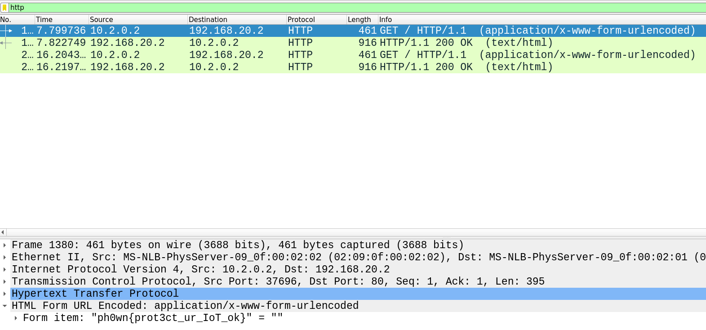

# Gnomes of Zurich

- Category: Network
- Points: 320
- Authors: al1foobar, cryptax
- Author of the write up: cryptax
- Solved by 8 teams

## IP camera overview

We connect to our remote IP camera's HTTP web site and notice the web site has been defaced:



The settings and reboot have nothing interesting, but the **Telnet Admin** menu has several infos:

- There is something running on port **23000**
- Public IP address xxxx corresponds to private address *10.2.0.2*.



We try the command (with the public IP address) and, indeed, we reach a hacker's console (do not forget to enter `0000` after connection to switch to the botmaster console - actually other 4-digit values will also work). The Russian text translates to "I like chicken nuggets" and asks for a username.

*Note: if the participant searches for the Russian string, s/he'll find references to Mirai.*

We **cannot** connect on the cameras: as mentioned in the challenge description, this is due to the ongoing attack.
Therefore, we now head to the FortiGate or the FortiAnalyzer for more information.

## FortiGate overview

We connect to the FortiGate. In Log & Report > AntiVirus, we see see our network is apparently infected with Mirai:



The Mirai executables are apparently being downloaded from `http://10.2.0.2/bins/mirai.x86`.
The IP address `10.2.0.2` was mentioned previously in the defaced screenshot of cameras' Telnet Admin menu.
It is not the IP address of a camera, nor the FortiGate or the FortiAnalyzer, so it is probably an external host. At this point, we can imagine it is either an external compromised host or a *Command and Control (aka CnC, C2) host.

Log & Report > *Web Filter* also shows all our remote cameras accessed `10.2.0.2` web site. They should not be doing that.

In Log & Report > *Application Control*, we see several entries:

- Going to `10.2.0.2`: NetBIOS.SSN. 10.2.0.2 apparently resolves to scan.test.bigbrother.com. So, probably the CnC.
- Coming from `10.2.0.2`: **Telnet**. This means 10.2.0.2 tried to telnet on our remote cameras... 

In Log & Report > *Intrusion Prevention* shows several attacks under the name Mirai.Botnet, Hajime, or Sora.


We get similar reports from the **FortiAnalyzer**. Go in FortiView, then Top Threats. Mirai, Hajime, Sora and Telnet are mentioned.


**Conclusion: our network is infected with Mirai, or Hajime, or Sora, or something similar. Our cameras communication with suspicious host 10.2.0.2**.

## Packet capture

We do a packet capture. As we can't connect to our cameras any longer, the only option is to do it from the FortiGate.

- Network > *Packet Capture* > Create, on interface `wan`, then start.

Once completed, we download the *pcap* file, and open it with *Wireshark*. We spot:

- Many packets going to or from `10.2.0.2`.


- **Telnet** packets. The data for those packets varies, but it apparently contains debug messages such as  `[main] received 14 bytes from CNC`, `[attack] starting attack`, `http flood` etc. There are several places where the word Mirai can be seen.


- A few **HTTP packets**. The HTTP request has interesting content: `Mirai BotMaster Console credentials: <ul><li>user: assassins</li><li>password: we_want_megabucks</li></ul><br>`. Oh! Credentials :) Also note *Mirai* is mentioned.


Conclusion:

- Our cameras are infected by **Mirai** botnet
- `10.2.0.2` is likely to be the CnC of the botnet
- We have credentials for the botmaster console

*Assassins are another group from the Illuminati game, against the Gnomes  of Zurich*.

## BotMaster Console

Summarizing information we colleced from the defaced web site of our cameras and packet capture on the FortiGate, we know:

- 10.2.0.2 is the private IP address for `x.x.x.x` (public one - changes for each team)
- There is a botmaster console there, running on port 23000
- We have the credentials for the botmaster console

So, we connect, enter `0000`, then the credentials are get to a prompt.



We try various commands and find that `?` displays all attacks:

- greip: GRE IP flood
- greeth: GRE Ethernet flood
- udpplain: UDP flood with less options. optimized for higher PPS
- vse: Valve source engine specific flood
- dns: DNS resolver flood using the targets domain, input IP is ignored
- ack: ACK flood
- stomp: TCP stomp flood
- http: HTTP flood
- flag: Special command :)
- udp: UDP flood
- syn: SYN flood

The **flag** command catches our attention. We must "specify prefix/netmask as targets" and a "duration".

```
assassins@botnet# flag 10.2.0.2 2
flag 10.2.0.2 2
```

Nothing apparently happens but the command seems valid.

## Re-packet capture

All Mirai attacks are network attacks: sending UDP packets, TCP flood, HTTP flood etc. So, let's do again a packet capture during our attack.




The flag is in an HTTP packet: **ph0wn{prot3t_ur_IoT_ok}**
